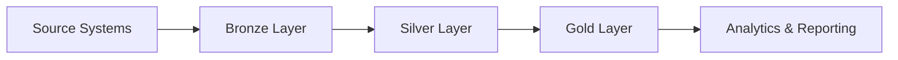

# Data Layers

The Dagster platform implements a three-tier data architecture following the medallion pattern:

## Bronze Layer (Raw Data)

The bronze layer contains raw, unprocessed data directly from source systems.

### Characteristics
- **Format**: Original format (JSON, CSV, Parquet, etc.)
- **Schema**: Flexible, schema-on-read
- **Quality**: No validation or cleansing
- **Retention**: Long-term storage for audit and reprocessing

### Use Cases
- Data lake ingestion
- Historical data preservation
- Reprocessing scenarios
- Audit trails

### Example Assets

```python
@asset(
    compute_kind="bronze",
    group_name="raw_data"
)
def raw_customer_data(context: AssetExecutionContext) -> None:
    """Ingest raw customer data from source system."""
    # Extract data from source
    pass
```

## Silver Layer (Cleaned Data)

The silver layer contains cleaned, validated, and conformed data.

### Characteristics
- **Format**: Structured (Parquet, Delta)
- **Schema**: Enforced schema
- **Quality**: Validated and cleaned
- **Retention**: Medium-term for analytics

### Transformations
- Data cleansing
- Schema validation
- Deduplication
- Standardization

### Example Assets

```python
@asset(
    compute_kind="silver",
    group_name="cleaned_data",
    deps=[raw_customer_data]
)
def cleaned_customer_data(context: AssetExecutionContext) -> None:
    """Clean and validate customer data."""
    # Apply data quality rules
    pass
```

## Gold Layer (Business Ready)

The gold layer contains aggregated, business-ready data for analytics and reporting.

### Characteristics
- **Format**: Optimized for consumption
- **Schema**: Business-oriented
- **Quality**: Highly refined
- **Retention**: Long-term for business use

### Transformations
- Business logic application
- Aggregations
- Dimensional modeling
- Metric calculations

### Example Assets

```python
@asset(
    compute_kind="gold",
    group_name="business_metrics",
    deps=[cleaned_customer_data]
)
def customer_metrics(context: AssetExecutionContext) -> None:
    """Calculate customer business metrics."""
    # Apply business logic
    pass
```

## Data Flow



## Best Practices

1. **Immutability**: Keep bronze layer immutable
2. **Versioning**: Version schema changes
3. **Lineage**: Track data lineage across layers
4. **Quality**: Implement checks at each layer
5. **Partitioning**: Partition by time for performance

## Related Documentation

- [Platform Overview](platform-overview.md)
- [Asset Development](../best-practices/asset-development.md)
- [Data Quality](../governance/data-quality.md)