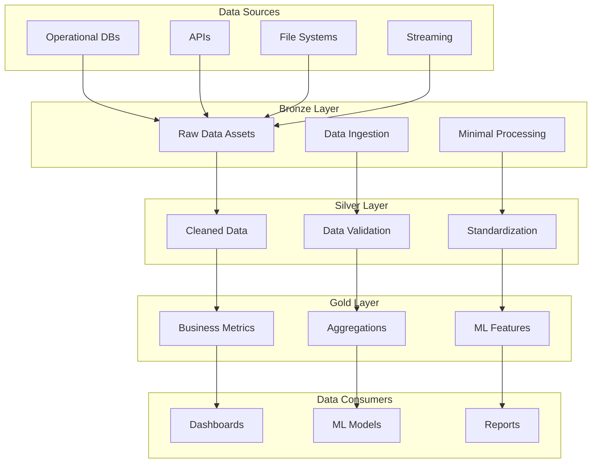

# Platform Overview

The Dagster Platform is designed as a modern, scalable data engineering solution that follows best practices for enterprise data processing. This document provides a comprehensive overview of the platform architecture and design decisions.

## Architecture Principles

### 1. Asset-Centric Design
The platform is built around **Dagster assets** rather than traditional jobs or tasks. This approach provides:

- **Clear data lineage** - Every data transformation is tracked
- **Dependency management** - Automatic resolution of asset dependencies
- **Incremental computation** - Only recompute what has changed
- **Observable data** - Rich metadata and quality metrics

### 2. Medallion Architecture
Data flows through three distinct layers:



### 3. Intelligent Compute Orchestration
The platform automatically selects the most appropriate compute resource based on workload characteristics:

| Compute Type | Ideal For | Cost | Scaling |
|-------------|-----------|------|---------|
| **AWS Lambda** | Quick transformations, triggers | Very Low | Automatic |
| **AWS Fargate** | Medium workloads, containers | Low | Manual |
| **Amazon EKS** | Large workloads, parallel processing | Medium | Auto/Manual |
| **AWS Batch** | Long-running, batch processing | Variable | Automatic |

## Core Components

### Platform Core (`dagster-platform`)

The platform core provides shared utilities and abstractions:

```python
# Resource management
from platform_core.resources import S3Resource, PostgresResource

# Data quality framework
from platform_core.asset_checks import validate_schema, check_freshness

# Compute optimization
from platform_core.sdk.decorators import lambda_compute, fargate_compute
```

#### Key Modules:

**Resources** (`platform_core.resources`)
- Database connections (PostgreSQL, Redshift, Snowflake)
- Cloud storage (S3, GCS, Azure Blob)
- API integrations (REST, GraphQL)
- Secrets management

**Asset Checks** (`platform_core.asset_checks`)
- Schema validation
- Data quality monitoring
- Freshness checks
- Custom business rule validation

**SDK** (`platform_core.sdk`)
- Asset decorators for bronze/silver/gold layers
- Compute-specific decorators
- Factory functions for common patterns
- Type definitions and utilities

**Observability** (`platform_core.observability`)
- Execution hooks for monitoring
- Sensor definitions for event-driven processing
- Metrics collection and reporting
- Alert management

### Project Template (`dagster-project-template`)

A Cookiecutter template providing:

- **Standardized project structure**
- **Example implementations** for each data layer
- **Configuration templates** for different environments
- **CI/CD pipeline definitions**
- **Testing frameworks** and examples

## Data Flow Architecture

### 1. Bronze Layer - Raw Data Ingestion

**Purpose**: Ingest raw data with minimal processing

```python
@bronze_asset(
    name="raw_customer_data",
    description="Raw customer data from CRM system"
)
@lambda_compute(timeout_seconds=300, memory_mb=512)
def raw_customer_data(context, database: PostgresResource):
    """Ingest raw customer data with minimal processing."""
    query = """
    SELECT customer_id, first_name, last_name, email, 
           created_at, updated_at
    FROM customers
    WHERE updated_at >= CURRENT_DATE - INTERVAL '1 day'
    """
    return database.execute_query(query)
```

**Characteristics**:
- Minimal data transformation
- Fast ingestion using Lambda
- Preserve original data structure
- Fault-tolerant with retry logic

### 2. Silver Layer - Data Cleaning and Validation

**Purpose**: Clean, validate, and standardize data

```python
@silver_asset(
    name="cleaned_customer_data",
    description="Cleaned and validated customer data",
    data_quality_checks=["no_nulls", "unique_values", "schema_validation"]
)
@fargate_compute(cpu_units=512, memory_mb=1024)
def cleaned_customer_data(context, raw_customer_data: pd.DataFrame):
    """Clean and validate customer data."""
    df = raw_customer_data.copy()
    
    # Data cleaning operations
    df = remove_duplicates(df)
    df = standardize_formats(df)
    df = validate_business_rules(df)
    
    return df
```

**Characteristics**:
- Comprehensive data quality checks
- Standardized data formats
- Fargate compute for consistent performance
- Detailed quality metrics and reporting

### 3. Gold Layer - Business Logic and Analytics

**Purpose**: Generate business metrics and analytical insights

```python
@gold_asset(
    name="customer_lifetime_value",
    description="Customer lifetime value calculations",
    business_owner="analytics_team"
)
@eks_compute(node_type="m5.large", min_nodes=2, max_nodes=10)
def customer_lifetime_value(
    context, 
    cleaned_customer_data: pd.DataFrame,
    order_history: pd.DataFrame
):
    """Calculate customer lifetime value metrics."""
    return calculate_clv(cleaned_customer_data, order_history)
```

**Characteristics**:
- Complex business logic
- EKS compute for scalability
- Rich metadata and lineage
- Business-focused metrics

## Compute Orchestration Details

### Lambda Compute
```python
@lambda_compute(
    timeout_seconds=900,      # Maximum 15 minutes
    memory_mb=3008,          # Up to 3GB memory
    environment_variables={   # Custom environment
        "LOG_LEVEL": "INFO"
    }
)
def quick_validation(context, data: pd.DataFrame):
    """Fast data validation using Lambda."""
    return validate_data_format(data)
```

**Best For**:
- Data validation and quality checks
- Simple transformations
- Event-driven processing
- Cost-sensitive workloads

### Fargate Compute
```python
@fargate_compute(
    cpu_units=1024,          # 1 vCPU
    memory_mb=2048,          # 2GB memory
    execution_role_arn="arn:aws:iam::123456789012:role/TaskRole"
)
def data_processing(context, raw_data: pd.DataFrame):
    """Medium-scale data processing on Fargate."""
    return process_data(raw_data)
```

**Best For**:
- Containerized workloads
- Predictable resource requirements
- Medium-duration processing
- Isolated execution environments

### EKS Compute
```python
@eks_compute(
    node_type="m5.xlarge",
    min_nodes=1,
    max_nodes=20,
    spot_instances=True
)
def large_scale_analytics(context, datasets: List[pd.DataFrame]):
    """Large-scale analytics on EKS."""
    return parallel_processing(datasets)
```

**Best For**:
- Large-scale data processing
- Parallel/distributed computing
- Machine learning workloads
- Auto-scaling requirements

## Resource Management

### Database Resources
```python
# PostgreSQL connection
postgres = PostgresResource(
    host="prod-db.example.com",
    port=5432,
    database="analytics",
    username="dagster_user",
    password=EnvVar("POSTGRES_PASSWORD")
)

# Query execution with automatic connection management
df = postgres.execute_query("SELECT * FROM customers")
```

### Cloud Storage Resources
```python
# S3 integration
s3 = S3Resource(
    bucket_name="analytics-data-lake",
    region_name="eu-west-2"
)

# File operations
s3.upload_file("local_file.csv", "processed/data.csv")
files = s3.list_objects(prefix="raw/")
```

### API Resources
```python
# REST API integration
api = HTTPResource(
    base_url="https://api.example.com",
    auth_token=EnvVar("API_TOKEN")
)

# API calls with error handling
response = api.get("/customers", params={"limit": 1000})
```

## Data Quality Framework

### Built-in Quality Checks
```python
from platform_core.asset_checks import (
    check_no_nulls,
    check_unique_values,
    check_row_count,
    validate_schema
)

# Automatic quality validation
@silver_asset(data_quality_checks=["no_nulls", "unique_values"])
def validated_data(context, raw_data: pd.DataFrame):
    return clean_data(raw_data)
```

### Custom Quality Checks
```python
@asset_check(asset="customer_data")
def validate_email_format(context, customer_data: pd.DataFrame):
    """Validate email format in customer data."""
    email_pattern = r'^[a-zA-Z0-9._%+-]+@[a-zA-Z0-9.-]+\.[a-zA-Z]{2,}$'
    invalid_emails = ~customer_data['email'].str.match(email_pattern)
    
    return AssetCheckResult(
        passed=invalid_emails.sum() == 0,
        description=f"Found {invalid_emails.sum()} invalid email addresses"
    )
```

## Observability and Monitoring

### Execution Hooks
```python
@success_hook
def log_success_metrics(context):
    """Log success metrics for monitoring."""
    context.log.info(f"Asset {context.asset_key} completed successfully")
    
@failure_hook
def alert_on_failure(context):
    """Send alerts on pipeline failures."""
    send_slack_alert(f"Pipeline failed: {context.failure_data}")
```

### Sensors and Triggers
```python
@sensor(job=data_processing_job)
def s3_file_sensor(context):
    """Trigger pipeline when new files arrive in S3."""
    new_files = check_for_new_files()
    if new_files:
        return RunRequest(
            run_key=f"s3_files_{datetime.now().isoformat()}",
            run_config={"resources": {"s3": {"config": {"files": new_files}}}}
        )
```

## Security and Compliance

### Data Protection
- **Encryption at rest** - All data encrypted in storage
- **Encryption in transit** - TLS for all communications
- **Access controls** - Role-based access to resources
- **Audit logging** - Comprehensive execution logs

### Compliance Features
- **PII Detection** - Automatic identification of sensitive data
- **Data Masking** - Configurable data obfuscation
- **Retention Policies** - Automatic data lifecycle management
- **Lineage Tracking** - Complete data provenance

### Configuration Management
```python
# Environment-specific configuration
resources = {
    "database": PostgresResource(
        host=EnvVar("DATABASE_HOST"),
        password=EnvVar("DATABASE_PASSWORD")
    ),
    "s3": S3Resource(
        bucket_name=EnvVar("S3_BUCKET_NAME")
    )
}
```

## Performance Optimization

### Partitioning Strategies
```python
# Time-based partitioning
@asset(partitions_def=DailyPartitionsDefinition(start_date="2024-01-01"))
def daily_metrics(context, raw_data: pd.DataFrame):
    """Process daily metrics with time partitioning."""
    partition_date = context.asset_partition_key_for_output()
    return process_daily_data(raw_data, partition_date)
```

### Caching and Memoization
```python
# Intelligent caching
@asset(
    freshness_policy=FreshnessPolicy(
        maximum_lag_minutes=60,
        cron_schedule="0 * * * *"  # Hourly refresh
    )
)
def cached_metrics(context, source_data: pd.DataFrame):
    """Cached metrics with freshness policy."""
    return expensive_calculation(source_data)
```

## Cost Optimization

### Automatic Cost Management
- **Spot Instance Integration** - Use spot instances for cost savings
- **Right-sizing** - Automatic resource allocation based on workload
- **Idle Detection** - Shutdown unused resources
- **Cost Attribution** - Track costs per job and project

### Cost Tracking
```python
@cost_tracked_asset(
    compute_kind="eks",
    estimated_cost_per_run=2.50
)
def expensive_operation(context, data: pd.DataFrame):
    """Track costs for expensive operations."""
    return complex_processing(data)
```

## Next Steps

Now that you understand the platform architecture:

1. **[Data Layers](data-layers.md)** - Deep dive into bronze/silver/gold patterns
2. **[Compute Orchestration](compute-orchestration.md)** - Learn about compute selection
3. **[Resource Management](resource-management.md)** - Understand resource configuration
4. **[Platform Core](../platform-core/resources.md)** - Explore core components

## Architecture Benefits

### Developer Experience
- **Rapid Development** - Templates and patterns accelerate development
- **Type Safety** - Strong typing throughout the platform
- **Testing Framework** - Built-in testing utilities
- **Documentation** - Auto-generated API docs

### Operational Excellence
- **Monitoring** - Comprehensive observability
- **Alerting** - Multi-channel notification system
- **Scaling** - Automatic resource scaling
- **Recovery** - Built-in failure recovery

### Cost Efficiency
- **Resource Optimization** - Intelligent compute selection
- **Spot Instances** - Cost-effective compute options
- **Usage Tracking** - Detailed cost attribution
- **Right-sizing** - Automatic resource optimization

This architecture provides a solid foundation for building scalable, maintainable, and cost-effective data pipelines while maintaining the highest standards of data quality and security.