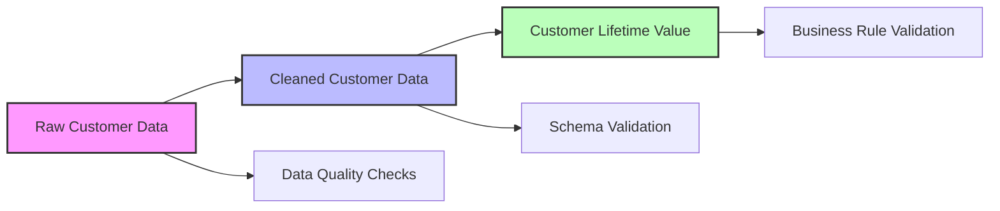

# Quick Start

Get your first data pipeline running in under 10 minutes! This guide will walk you through creating a simple pipeline using the Dagster Platform.

## Step 1: Create a New Project

Use the Cookiecutter template to generate a new project:

```bash
# Install cookiecutter if not already installed
pip install cookiecutter

# Generate project from template
cookiecutter dagster-project-template/

# Follow the prompts:
# project_name [my-dagster-project]: customer-analytics
# project_description [A new Dagster data pipeline project]: Customer analytics pipeline
# author_name [Data Engineering Team]: Your Name
# use_dbt [yes]: no
# compute_environment [lambda]: fargate
# data_warehouse [postgres]: postgres
# enable_data_quality_checks [yes]: yes
```

This creates a new project structure:

```
customer-analytics/
├── assets/
│   ├── bronze/          # Raw data ingestion
│   ├── silver/          # Data cleaning
│   └── gold/            # Business metrics
├── jobs/                # Pipeline jobs
├── schedules/           # Time-based triggers
├── sensors/             # Event-driven triggers
├── tests/               # Test suite
└── config/              # Environment configurations
```

## Step 2: Install Project Dependencies

Navigate to your new project and install dependencies:

```bash
cd customer-analytics
pip install -e .
```

## Step 3: Configure Resources

Edit the configuration file to set up your data connections:

```yaml
# config/dev.yaml
resources:
  database:
    config:
      host: localhost
      port: 5432
      database: analytics_dev
      username: dagster
      password: dagster
  
  s3:
    config:
      bucket_name: my-analytics-bucket
      region_name: eu-west-2
```

## Step 4: Explore the Sample Pipeline

The generated project includes sample assets demonstrating the bronze/silver/gold pattern:

### Bronze Asset (Raw Data Ingestion)
```python
@bronze_asset(
    name="raw_customer_data",
    description="Raw customer data from source system"
)
@lambda_compute(timeout_seconds=300)
def raw_customer_data(context, database: PostgresResource):
    """Ingest raw customer data from the source database."""
    query = "SELECT * FROM customers WHERE updated_at >= CURRENT_DATE - INTERVAL '7 days'"
    return database.execute_query(query)
```

### Silver Asset (Data Cleaning)
```python
@silver_asset(
    name="cleaned_customer_data",
    description="Cleaned and validated customer data",
    data_quality_checks=["no_nulls", "row_count"]
)
@fargate_compute(cpu_units=512, memory_mb=1024)
def cleaned_customer_data(context, raw_customer_data: pd.DataFrame):
    """Clean and validate customer data."""
    df = raw_customer_data.copy()
    
    # Remove duplicates
    df = df.drop_duplicates(subset=['customer_id'])
    
    # Clean email addresses
    df['email'] = df['email'].str.lower().str.strip()
    
    # Validate required fields
    df = df.dropna(subset=['customer_id', 'first_name', 'last_name'])
    
    return df
```

### Gold Asset (Business Metrics)
```python
@gold_asset(
    name="customer_lifetime_value",
    description="Customer lifetime value calculations",
    business_owner="analytics_team"
)
@eks_compute(node_type="m5.large")
def customer_lifetime_value(context, cleaned_customer_data: pd.DataFrame):
    """Calculate customer lifetime value."""
    # Business logic for CLV calculation
    clv_df = calculate_clv(cleaned_customer_data)
    return clv_df
```

## Step 5: Start the Development Server

Launch the Dagster development server:

```bash
dagster dev
```

This starts the web interface at `http://localhost:3000` where you can:

- View your asset lineage graph
- Monitor pipeline runs
- Trigger jobs manually
- Explore asset metadata

## Step 6: Materialize Your First Asset

In the Dagster UI:

1. Navigate to **Assets** in the left sidebar
2. Select the `raw_customer_data` asset
3. Click **Materialize** to run the asset
4. Monitor the execution in the **Runs** tab

## Step 7: Run the Complete Pipeline

Execute the full pipeline by materializing all assets:

1. Go to **Assets** → **View global asset lineage**
2. Select all assets (bronze → silver → gold)
3. Click **Materialize selected**
4. Watch the pipeline execute in dependency order

## Step 8: Explore Data Quality Results

The platform automatically runs data quality checks:

1. Navigate to **Asset checks** in the UI
2. Review the results of quality validations
3. Explore any failed checks and their details

## Understanding the Pipeline Flow



## Next Steps

Now that you have a working pipeline, you can:

### 1. Add More Assets
Create additional assets for your specific use case:

```python
@silver_asset(name="product_sales_data")
@fargate_compute()
def product_sales_data(context, raw_sales_data: pd.DataFrame):
    """Process sales data."""
    # Your data processing logic
    return processed_data
```

### 2. Schedule Your Pipeline
Add a schedule to run your pipeline automatically:

```python
from dagster import schedule, ScheduleEvaluationContext

@schedule(
    job=full_pipeline_job,
    cron_schedule="0 6 * * *",  # Daily at 6 AM
    description="Daily customer analytics pipeline"
)
def daily_pipeline_schedule(context: ScheduleEvaluationContext):
    return {}
```

### 3. Add Custom Data Quality Checks
Implement business-specific validation rules:

```python
@asset_check(asset="customer_lifetime_value")
def validate_clv_positive(context, customer_lifetime_value: pd.DataFrame):
    """Ensure all CLV values are positive."""
    negative_clv = customer_lifetime_value[customer_lifetime_value['estimated_clv'] < 0]
    
    return AssetCheckResult(
        passed=len(negative_clv) == 0,
        description=f"Found {len(negative_clv)} customers with negative CLV"
    )
```

### 4. Set Up Alerts
Configure notifications for pipeline failures:

```python
@failure_hook
def slack_failure_alert(context):
    """Send Slack notification on pipeline failure."""
    slack_webhook_url = os.getenv("SLACK_WEBHOOK_URL")
    if slack_webhook_url:
        send_slack_message(
            webhook_url=slack_webhook_url,
            message=f"Pipeline {context.job_name} failed: {context.failure_data}"
        )
```

### 5. Deploy to Production
Follow the [deployment guide](../deployment/infrastructure.md) to deploy your pipeline to AWS.

## Common Patterns

### Working with Different Data Sources

=== "Database"
    
    ```python
    @bronze_asset
    def ingest_from_database(context, database: PostgresResource):
        return database.execute_query("SELECT * FROM source_table")
    ```

=== "S3"
    
    ```python
    @bronze_asset
    def ingest_from_s3(context, s3: S3Resource):
        files = s3.list_objects(prefix="data/")
        return pd.concat([pd.read_csv(f) for f in files])
    ```

=== "API"
    
    ```python
    @bronze_asset
    def ingest_from_api(context, api: HTTPResource):
        response = api.get("/data/customers")
        return pd.DataFrame(response.json())
    ```

### Data Quality Patterns

```python
# Schema validation
@silver_asset(
    schema_validated=True,
    expected_schema={
        "required_columns": ["customer_id", "email"],
        "column_types": {"customer_id": "integer", "email": "string"}
    }
)
def validated_customer_data(context, raw_data: pd.DataFrame):
    return clean_data(raw_data)

# Freshness monitoring
@gold_asset(freshness_policy_minutes=60)
def real_time_metrics(context, recent_data: pd.DataFrame):
    return calculate_metrics(recent_data)
```

## Troubleshooting

### Common Issues

??? warning "Asset won't materialize"
    
    Check the logs in the UI for specific error messages. Common causes:
    - Missing dependencies
    - Database connection issues
    - Invalid data format

??? warning "Data quality checks failing"
    
    Review the check results in the UI. You may need to:
    - Update your data cleaning logic
    - Adjust quality check thresholds
    - Handle edge cases in your data

??? warning "Performance issues"
    
    Consider:
    - Using appropriate compute types for your workload
    - Partitioning large datasets
    - Optimizing your data processing logic

## What's Next?

Congratulations! You've successfully created and run your first Dagster pipeline. To continue learning:

1. **[Project Setup](project-setup.md)** - Configure a production-ready project
2. **[Architecture Guide](../architecture/platform-overview.md)** - Understand the platform design
3. **[Best Practices](../best-practices/asset-development.md)** - Learn advanced patterns
4. **[Deployment](../deployment/infrastructure.md)** - Deploy to production

## Example Projects

For more complex examples, check out:

- **Customer Analytics** - CLV calculation and segmentation
- **Product Recommendations** - ML-powered recommendation engine
- **Financial Reporting** - Automated financial dashboards
- **Real-time Monitoring** - Streaming data processing

These examples demonstrate advanced platform features and real-world usage patterns.