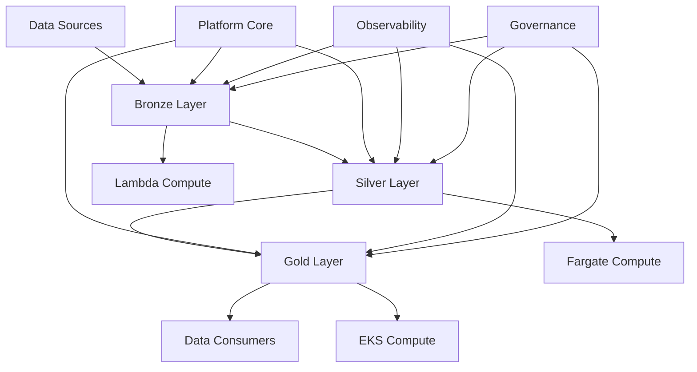

# Dagster Platform Documentation

<div class="govuk-banner">
  🚀 This is a comprehensive data engineering platform built with Dagster. 
  <a href="getting-started/quick-start/">Get started</a> or explore the <a href="architecture/platform-overview/">platform architecture</a>.
</div>

## Overview

Welcome to the Dagster Platform Documentation. This platform provides a modern, scalable foundation for building reliable, cost-effective data pipelines while maintaining strict governance and security standards for UK Civil Service data engineering teams.

<div class="grid cards" markdown>

-   :material-rocket-launch-outline: **Getting Started**

    ---
    
    Quick start guide to get your first pipeline running
    
    [:octicons-arrow-right-24: Start here](getting-started/overview.md)

-   :material-architecture: **Architecture**

    ---
    
    Learn about the platform's design and core components
    
    [:octicons-arrow-right-24: Explore architecture](architecture/platform-overview.md)

-   :material-cog: **Platform Core**

    ---
    
    Deep dive into resources, asset checks, and core utilities
    
    [:octicons-arrow-right-24: Core components](platform-core/resources.md)

-   :material-monitor-dashboard: **Observability**

    ---
    
    Monitoring, alerting, and operational excellence
    
    [:octicons-arrow-right-24: Monitoring guide](observability/monitoring.md)

</div>

## Key Features

### 🏗️ Asset-Centric Architecture
Built around Dagster assets with bronze, silver, and gold data layers for better lineage tracking and governance.

### ⚡ Intelligent Compute Orchestration
Automatic selection of compute resources based on workload characteristics:
- **Lambda** for stateless validation and triggers
- **Fargate** for short-lived containerized tasks
- **EKS + Karpenter** for parallel processing with auto-scaling
- **EC2 Spot/Batch** for long-running or GPU-intensive workloads

### 🔍 Comprehensive Data Quality
- Automated data quality validation with asset checks
- Schema validation and monitoring
- Data freshness and continuity checks
- Built-in PII detection and masking

### 💰 Cost Management
- Spot instance integration for cost-effective processing
- Per-job cost attribution and tracking
- Automated resource right-sizing
- Idle resource detection

### 🔒 Security & Governance
- Security by design principles
- GDPR and UK Data Protection compliance
- Built-in governance policies
- Comprehensive audit trails

## Platform Components

### Core Infrastructure

=== "Platform Core"
    
    The `dagster-platform` package provides shared utilities and resources:
    
    - **Resources**: AWS, Database, and API integrations
    - **Asset Checks**: Data quality and validation framework
    - **Partitions**: Common partitioning strategies
    - **IO Managers**: Standardized data I/O patterns
    - **Compute Kinds**: Compute type definitions

=== "Project Template"
    
    The `dagster-project-template` provides:
    
    - **Cookiecutter Template**: Rapid project setup
    - **Bronze Assets**: Raw data ingestion patterns
    - **Silver Assets**: Data cleaning and validation
    - **Gold Assets**: Business logic and analytics
    - **Job Definitions**: Pipeline orchestration

=== "Observability"
    
    Comprehensive monitoring and alerting:
    
    - **Sensors**: File-based and schedule-based triggers
    - **Hooks**: Execution lifecycle management
    - **Metrics**: Custom metrics collection
    - **Alerts**: Multi-channel alerting system

## Quick Start

Get your first pipeline running in minutes:

```bash
# Install cookiecutter
pip install cookiecutter

# Generate a new project
cookiecutter dagster-project-template/

# Install dependencies
cd my-dagster-project
pip install -e .

# Start the development server
dagster dev
```

## Architecture Overview



## Design Principles

!!! info "Core Principles"
    
    - **Asset-centric architecture**: All data processing built around Dagster assets
    - **Separation of concerns**: Platform team manages infrastructure, project teams focus on business logic
    - **Configuration as code**: All pipeline definitions managed through version-controlled YAML
    - **Cost-conscious compute**: Intelligent workload placement across compute types
    - **Security by design**: Built-in compliance and governance tooling

## Support and Community

- **Documentation**: This comprehensive guide covers all aspects of the platform
- **API Reference**: Auto-generated API documentation from code
- **Examples**: Real-world examples and patterns
- **Troubleshooting**: Common issues and solutions

## Status

<span class="status-badge status-badge--stable">Stable</span> Platform Core  
<span class="status-badge status-badge--beta">Beta</span> Project Templates  
<span class="status-badge status-badge--alpha">Alpha</span> Advanced Features  

---

*This documentation is automatically generated from code and updated with each release. For the latest changes, see the [changelog](reference/changelog.md).*